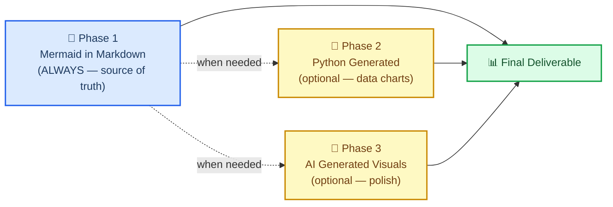
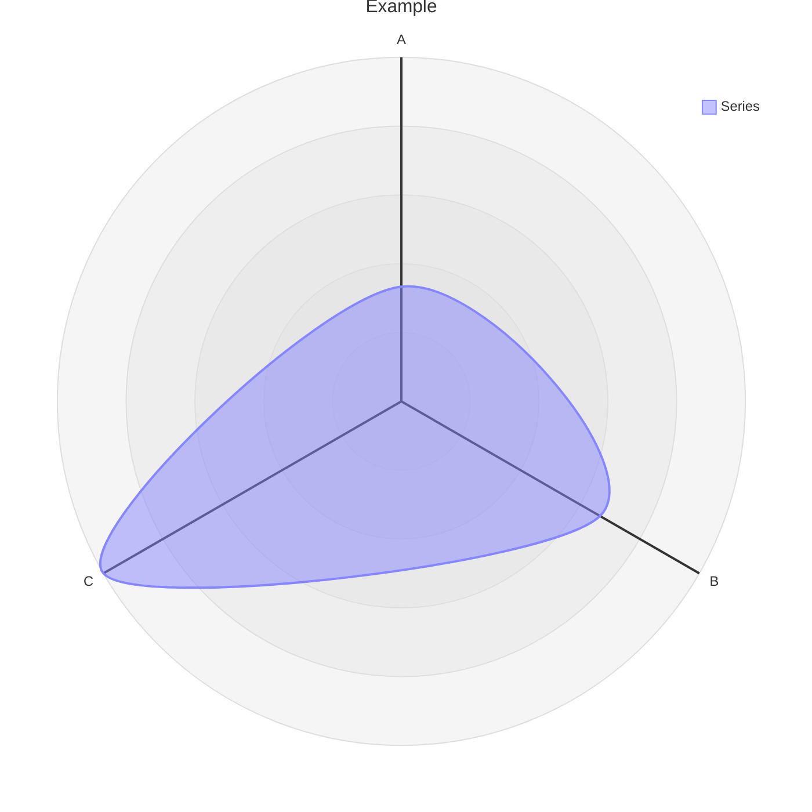
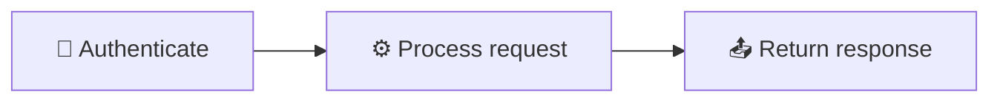
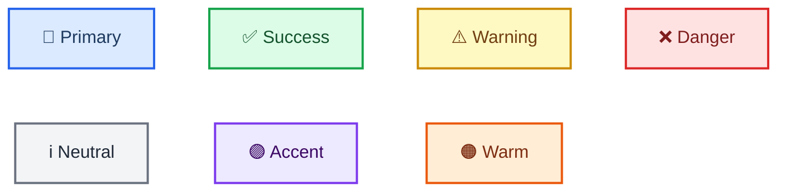

# Markdown and Mermaid Writing

## Overview

This skill teaches you — and enforces a standard for — creating scientific documentation
using **markdown with embedded Mermaid diagrams as the default and canonical format**.

The core bet: a relationship expressed as a Mermaid diagram inside a `.md` file is more
valuable than any image. It is text, so it diffs cleanly in git. It requires no build step.
It renders natively on GitHub, GitLab, Notion, VS Code, and any markdown viewer. It uses
fewer tokens than a prose description of the same relationship. And it can always be
converted to a polished image later — but the text version remains the source of truth.

> "The more you get your reports and files in .md in just regular text, which mermaid is
> as well as being a simple 'script language'. This just helps with any downstream rendering
> and especially AI generated images (using mermaid instead of just long form text to
> describe relationships < tokens). Additionally mermaid can render along with markdown for
> easy use almost anywhere by humans or AI."
>
> — Clayton Young (@borealBytes), K-Dense Discord, 2026-02-19

## When to Use This Skill

Use this skill when:

- Creating **any scientific document** — reports, analyses, manuscripts, methods sections
- Writing **any documentation** — READMEs, how-tos, decision records, project docs
- Producing **any diagram** — workflows, data pipelines, architectures, timelines, relationships
- Generating **any output that will be version-controlled** — if it's going into git, it should be markdown
- Working with **any other skill** — this skill defines the documentation layer that wraps every other output
- Someone asks you to "add a diagram" or "visualize the relationship" — Mermaid first, always

Do NOT start with Python matplotlib, seaborn, or AI image generation for structural or relational diagrams.
Those are Phase 2 and Phase 3 — only used when Mermaid cannot express what's needed (e.g., scatter plots with real data, photorealistic images).

## 🎨 The Source Format Philosophy

### Why text-based diagrams win

| What matters | Mermaid in Markdown | Python / AI Image |
| ----------------------------- | :-----------------: | :---------------: |
| Git diff readable | ✅ | ❌ binary blob |
| Editable without regenerating | ✅ | ❌ |
| Token efficient vs. prose | ✅ smaller | ❌ larger |
| Renders without a build step | ✅ | ❌ needs hosting |
| Parseable by AI without vision | ✅ | ❌ |
| Works in GitHub / GitLab / Notion | ✅ | ⚠️ if hosted |
| Accessible (screen readers) | ✅ accTitle/accDescr | ⚠️ needs alt text |
| Convertible to image later | ✅ anytime | — already image |

### The three-phase workflow



**Phase 1 is mandatory.** Even if you proceed to Phase 2 or 3, the Mermaid source stays committed.

### What Mermaid can express

Mermaid covers 24 diagram types. Almost every scientific relationship fits one:

| Use case | Diagram type | File |
| -------------------------------------------- | ---------------- | ---------------------------------------------------- |
| Experimental workflow / decision logic | Flowchart | `references/diagrams/flowchart.md` |
| Service interactions / API calls / messaging | Sequence | `references/diagrams/sequence.md` |
| Data model / schema | ER diagram | `references/diagrams/er.md` |
| State machine / lifecycle | State | `references/diagrams/state.md` |
| Project timeline / roadmap | Gantt | `references/diagrams/gantt.md` |
| Proportions / composition | Pie | `references/diagrams/pie.md` |
| System architecture (zoom levels) | C4 | `references/diagrams/c4.md` |
| Concept hierarchy / brainstorm | Mindmap | `references/diagrams/mindmap.md` |
| Chronological events / history | Timeline | `references/diagrams/timeline.md` |
| Class hierarchy / type relationships | Class | `references/diagrams/class.md` |
| User journey / satisfaction map | User Journey | `references/diagrams/user_journey.md` |
| Two-axis comparison / prioritization | Quadrant | `references/diagrams/quadrant.md` |
| Requirements traceability | Requirement | `references/diagrams/requirement.md` |
| Flow magnitude / resource distribution | Sankey | `references/diagrams/sankey.md` |
| Numeric trends / bar + line charts | XY Chart | `references/diagrams/xy_chart.md` |
| Component layout / spatial arrangement | Block | `references/diagrams/block.md` |
| Work item status / task columns | Kanban | `references/diagrams/kanban.md` |
| Cloud infrastructure / service topology | Architecture | `references/diagrams/architecture.md` |
| Multi-dimensional comparison / skills radar | Radar | `references/diagrams/radar.md` |
| Hierarchical proportions / budget | Treemap | `references/diagrams/treemap.md` |
| Binary protocol / data format | Packet | `references/diagrams/packet.md` |
| Git branching / merge strategy | Git Graph | `references/diagrams/git_graph.md` |
| Code-style sequence (programming syntax) | ZenUML | `references/diagrams/zenuml.md` |
| Multi-diagram composition patterns | Complex Examples | `references/diagrams/complex_examples.md` |

> 💡 **Pick the right type, not the easy one.** Don't default to flowcharts for everything.
> A timeline beats a flowchart for chronological events. A sequence beats a flowchart for
> service interactions. Scan the table and match.

---

## 🔧 Core workflow

### Step 1: Identify the document type

Check if a template exists before writing from scratch:

| Document type | Template |
| ------------------------------ | ----------------------------------------------- |
| Pull request record | `templates/pull_request.md` |
| Issue / bug / feature request | `templates/issue.md` |
| Sprint / project board | `templates/kanban.md` |
| Architecture decision (ADR) | `templates/decision_record.md` |
| Presentation / briefing | `templates/presentation.md` |
| Research paper / analysis | `templates/research_paper.md` |
| Project documentation | `templates/project_documentation.md` |
| How-to / tutorial | `templates/how_to_guide.md` |
| Status report | `templates/status_report.md` |

### Step 2: Read the style guide

Before writing any `.md` file: read `references/markdown_style_guide.md`.

Key rules to internalize:

- **One H1 per document** — the title. Never more.
- **Emoji on H2 headings only** — one emoji per H2, none in H3/H4
- **Cite everything** — every external claim gets a footnote `[^N]` with full URL
- **Bold sparingly** — max 2-3 bold terms per paragraph, never full sentences
- **Horizontal rule after every `</details>`** — mandatory
- **Tables over prose** for comparisons, configurations, structured data
- **Diagrams over walls of text** — if it describes flow, structure, or relationships, add Mermaid

### Step 3: Pick the diagram type and read its guide

Before creating any Mermaid diagram: read `references/mermaid_style_guide.md`.

Then open the specific type file (e.g., `references/diagrams/flowchart.md`) for the exemplar, tips, and copy-paste template.

Mandatory rules for every diagram:

```
accTitle: Short Name 3-8 Words
accDescr: One or two sentences explaining what this diagram shows.
```

- **No `%%{init}` directives** — breaks GitHub dark mode
- **No inline `style`** — use `classDef` only
- **One emoji per node max** — at the start of the label
- **`snake_case` node IDs** — match the label

### Step 4: Write the document

Start from the template. Apply the markdown style guide. Place diagrams inline with related text — not in a separate "Figures" section.

### Step 5: Commit as text

The `.md` file with embedded Mermaid is what gets committed. If you also generated a PNG or AI image, those are supplementary — the markdown is the source.

---

## ⚠️ Common pitfalls

### Radar chart syntax (`radar-beta`)

**WRONG:**
```mermaid
radar
title Example
x-axis ["A", "B", "C"]
"Series" : [1, 2, 3]
```

**CORRECT:**


- **Use `radar-beta`** not `radar` (the bare keyword doesn't exist)
- **Use `axis`** to define dimensions, **not** `x-axis`
- **Use `curve`** to define data series, **not** quoted labels with colon
- **No `accTitle`/`accDescr`** — radar-beta doesn't support accessibility annotations; always add a descriptive italic paragraph above the diagram

### XY Chart vs Radar confusion

| Diagram | Keyword | Axis syntax | Data syntax |
| ------- | ------- | ----------- | ----------- |
| **XY Chart** (bars/lines) | `xychart-beta` | `x-axis ["Label1", "Label2"]` | `bar [10, 20]` or `line [10, 20]` |
| **Radar** (spider/web) | `radar-beta` | `axis id["Label"]` | `curve id["Label"]{10, 20}` |

### Forgetting `accTitle`/`accDescr` on supported types

Only some diagram types support `accTitle`/`accDescr`. For those that don't, always place a descriptive italic paragraph directly above the code block:

> _Radar chart comparing three methods across five performance dimensions. Note: Radar charts do not support accTitle/accDescr._


---

## 🔗 Integration with other skills

### With `scientific-schematics`

`scientific-schematics` generates AI-powered publication-quality images (PNG). Use the Mermaid diagram as the **brief** for the schematic:

```
Workflow:
1. Create the concept as Mermaid in .md (this skill — Phase 1)
2. Describe the same concept to scientific-schematics for a polished PNG (Phase 3)
3. Commit both — the .md as source, the PNG as a supplementary figure
```

### With `scientific-writing`

When `scientific-writing` produces a manuscript, all diagrams and structural figures should use this skill's standards. The writing skill handles prose and citations; this skill handles visual structure.

```
Workflow:
1. Use scientific-writing to draft the manuscript
2. For every figure that shows a workflow, architecture, or relationship:
   - Replace placeholder with a Mermaid diagram following this skill's guide
3. Use scientific-schematics only for figures that truly need photorealistic/complex rendering
```

### With `literature-review`

Literature review produces summaries with lots of relationship data. Use this skill to:

- Create concept maps (Mindmap) of the literature landscape
- Show publication timelines (Timeline or Gantt)
- Compare methodologies (Quadrant or Radar)
- Diagram data flows described in papers (Sequence or Flowchart)

### With any skill that produces output documents

Before finalizing any document from any skill, apply this skill's checklist:

- [ ] Does the document use a template? If so, did I start from the right one?
- [ ] Are all diagrams in Mermaid with `accTitle` + `accDescr`?
- [ ] No `%%{init}`, no inline `style`, only `classDef`?
- [ ] Are all external claims cited with `[^N]`?
- [ ] One H1, emoji on H2 only?
- [ ] Horizontal rules after every `</details>`?

---

## 📚 Reference index

### Style guides

| Guide | Path | Lines | What it covers |
| ----------------------- | ------------------------------------------- | ----- | -------------------------------------------------- |
| Markdown Style Guide | `references/markdown_style_guide.md` | ~733 | Headings, formatting, citations, tables, Mermaid integration, templates, quality checklist |
| Mermaid Style Guide | `references/mermaid_style_guide.md` | ~458 | Accessibility, emoji set, color classes, theme neutrality, type selection, complexity tiers |

### Diagram type guides (24 types)

Each file contains: production-quality exemplar, tips specific to that type, and a copy-paste template.

`references/diagrams/` — architecture, block, c4, class, complex\_examples, er, flowchart, gantt, git\_graph, kanban, mindmap, packet, pie, quadrant, radar, requirement, sankey, sequence, state, timeline, treemap, user\_journey, xy\_chart, zenuml

### Document templates (9 types)

`templates/` — decision\_record, how\_to\_guide, issue, kanban, presentation, project\_documentation, pull\_request, research\_paper, status\_report

### Examples

`assets/examples/example-research-report.md` — a complete scientific research report demonstrating proper heading hierarchy, multiple diagram types (flowchart, sequence, gantt), tables, footnote citations, collapsible sections, and all style guide rules applied.

---

## 📝 Attribution

All style guides, diagram type guides, and document templates in this skill are ported from the `SuperiorByteWorks-LLC/agent-project` repository under the Apache-2.0 License.

- **Source**: https://github.com/SuperiorByteWorks-LLC/agent-project
- **Author**: Clayton Young / Superior Byte Works, LLC (@borealBytes)
- **License**: Apache-2.0

This skill (as part of claude-scientific-skills) is distributed under the MIT License. The included Apache-2.0 content is compatible for downstream use with attribution retained, as preserved in the file headers throughout this skill.

---

[^1]: GitHub Blog. (2022). "Include diagrams in your Markdown files with Mermaid." https://github.blog/2022-02-14-include-diagrams-markdown-files-mermaid/

[^2]: Mermaid. "Mermaid Diagramming and Charting Tool." https://mermaid.js.org/

---

## Reference: Markdown_Style_Guide

<!-- Source: https://github.com/SuperiorByteWorks-LLC/agent-project | License: Apache-2.0 | Author: Clayton Young / Superior Byte Works, LLC (Boreal Bytes) -->

# Markdown Style Guide

> **For AI agents:** Read this file for all core formatting rules. When creating any markdown document, follow these conventions for consistent, professional output. When a template exists for your document type, start from it — see [Templates](#templates).
>
> **For humans:** This guide ensures every markdown document in your project is clean, scannable, well-cited, and renders beautifully on GitHub. Reference it from your `AGENTS.md` or contributing guide.

**Target platform:** GitHub Markdown (Issues, PRs, Discussions, Wikis, `.md` files)
**Design goal:** Clear, professional documents that communicate effectively through consistent structure, meaningful formatting, proper citations, and strategic use of diagrams.

---

## Quick Start for Agents

1. **Identify the document type** → Check if a [template](#templates) exists
2. **Structure first** → Heading hierarchy, then content
3. **Apply formatting from this guide** → Headings, text, lists, tables, images, links
4. **Add citations** → Footnote references for all claims and sources
5. **Consider diagrams** → Would a [Mermaid diagram](mermaid_style_guide.md) communicate this better than text?
6. **Add collapsible sections** → For supplementary detail, speaker notes, or lengthy context
7. **Verify** → Run through the [quality checklist](#quality-checklist)

---

## Core Principles

| #   | Principle                         | Rule                                                                                                                                                                                       |
| --- | --------------------------------- | ------------------------------------------------------------------------------------------------------------------------------------------------------------------------------------------ |
| 1   | **Answer before they ask**        | Anticipate reader questions and address them inline. A great document resolves doubts as they form — the reader finishes with no lingering "but what about...?"                            |
| 2   | **Scannable first**               | Readers skim before they read. Use headings, bold, and lists to make the structure visible at a glance.                                                                                    |
| 3   | **Cite everything**               | Every claim, statistic, or external reference gets a footnote citation with a full URL. No orphan claims.                                                                                  |
| 4   | **Diagrams over walls of text**   | If a concept involves flow, relationships, or structure, use a [Mermaid diagram](mermaid_style_guide.md) alongside the text.                                                               |
| 5   | **Generous with information**     | Don't hide the details — surface them. Use collapsible sections for depth without clutter, but never omit information because "they probably don't need it." If it's relevant, include it. |
| 6   | **Consistent structure**          | Same heading hierarchy, same formatting patterns, same emoji placement across every document.                                                                                              |
| 7   | **One idea per section**          | Each heading should cover one topic. If you're covering two ideas, split into two headings.                                                                                                |
| 8   | **Professional but approachable** | Clean formatting, no clutter, no decorative noise — but not stiff or academic. Write like a senior engineer explains to a colleague.                                                       |

---

## 🗂️ Everything is Code

Everything is code. PRs, issues, kanban boards — they're all markdown files in your repo, not data trapped in a platform's database.

### Why this matters

- **Portable** — GitHub → GitLab → Gitea → anywhere. Your project management data isn't locked into any vendor. Switch platforms and your issues, PR records, and boards come with you — they're just files.
- **AI-native** — Agents can read every issue, PR record, and kanban board with local file access. No API tokens, no rate limits, no platform-specific queries. `grep` beats `gh api` every time.
- **Auditable** — Project management changes go through the same PR review process as code changes. Every board update, every issue status change — it's all in git history with attribution and timestamps.

### How it works

| What                 | Where it lives                                            | What GitHub does                                                                                                                                                   |
| -------------------- | --------------------------------------------------------- | ------------------------------------------------------------------------------------------------------------------------------------------------------------------ |
| **Pull requests**    | `docs/project/pr/pr-NNNNNNNN-short-description.md`        | GitHub PR is a thin pointer — humans go there to comment on diffs, approve, and watch CI. The record of what changed, why, and what was learned lives in the file. |
| **Issues**           | `docs/project/issues/issue-NNNNNNNN-short-description.md` | GitHub Issues is a notification and comment layer. Bug reports, feature requests, investigation logs, and resolutions live in the file.                            |
| **Kanban boards**    | `docs/project/kanban/{scope}-{id}-short-description.md`   | No external board tool needed. Modify the board in your branch, merge it with your PR. The board evolves with the codebase.                                        |
| **Decision records** | `docs/decisions/NNN-{slug}.md`                            | Not tracked in GitHub at all — purely repo-native.                                                                                                                 |

### The rule

> 📌 **Don't capture information in GitHub's UI that should be captured in a file.** Approve PRs in GitHub. Watch CI in GitHub. Comment in GitHub. But the actual content — the description, the investigation, the decision — lives in a committed file. If it's worth writing down, it's worth committing.

### Templates for tracked documents

- [Pull request record](markdown_templates/pull_request.md) — the PR description IS this file
- [Issue record](markdown_templates/issue.md) — bug reports and feature requests as repo files
- [Kanban board](markdown_templates/kanban.md) — sprint/project boards that merge with your code

See [File conventions](#file-conventions-for-tracked-documents) for directory structure and naming.

---

## Document Structure

### Title and metadata

Every document starts with exactly one H1 title, followed by a brief context line and a separator:

```markdown
# Document Title Here

_Brief context — project name, date, or purpose in one line_

---
```

- **One H1 per document** — never more
- Context line in italics — what this document is, when, and for whom
- Horizontal rule separates metadata from content

### Heading hierarchy

| Level | Syntax          | Use                     | Max per document    |
| ----- | --------------- | ----------------------- | ------------------- |
| H1    | `# Title`       | Document title          | **1** (exactly one) |
| H2    | `## Section`    | Major sections          | 4–10                |
| H3    | `### Topic`     | Topics within a section | 2–5 per H2          |
| H4    | `#### Subtopic` | Subtopics when needed   | 2–4 per H3          |
| H5+   | Never use       | —                       | 0                   |

**Rules:**

- **Never skip levels** — don't jump from H2 to H4
- **Emoji in H2 headings** — one emoji per H2, at the start: `## 📋 Project Overview`
- **No emoji in H3/H4** — keep sub-headings clean
- **Sentence case** — `## 📋 Project overview` not `## 📋 Project Overview` (exception: proper nouns)
- **Descriptive headings** — `### Authentication flow` not `### Details`

---

## Text Formatting

### Bold, italic, code

| Format     | Syntax       | When to use                                   | Example                             |
| ---------- | ------------ | --------------------------------------------- | ----------------------------------- |
| **Bold**   | `**text**`   | Key terms, important concepts, emphasis       | **Primary database** handles writes |
| _Italic_   | `*text*`     | Definitions, titles, subtle emphasis          | The process is called _sharding_    |
| `Code`     | `` `text` `` | Technical terms, commands, file names, values | Run `npm install` to install        |
| ~~Strike~~ | `~~text~~`   | Deprecated content, corrections               | ~~Old approach~~ replaced by v2     |

**Rules:**

- **Bold sparingly** — if everything is bold, nothing is. Max 2–3 bold terms per paragraph.
- **Don't combine** bold and italic (`***text***`) — pick one
- **Code for anything technical** — file names (`README.md`), commands (`git push`), config values (`true`), environment variables (`NODE_ENV`)
- **Never bold entire sentences** — bold the key word(s) within the sentence

### Blockquotes

Use blockquotes for definitions, callouts, and important notes:

```markdown
> **Definition:** A _load balancer_ distributes incoming network traffic
> across multiple servers to ensure no single server bears too much demand.
```

For warnings and callouts:

```markdown
> ⚠️ **Warning:** This operation is destructive and cannot be undone.

> 💡 **Tip:** Use `--dry-run` to preview changes before applying.

> 📌 **Note:** This requires admin permissions on the repository.
```

- Prefix with emoji + bold label for typed callouts
- Keep blockquotes to 1–3 lines
- Don't nest blockquotes (`>>`)

---

## Lists

### When to use each type

| List type | Syntax       | Use when                                  |
| --------- | ------------ | ----------------------------------------- |
| Bullet    | `- item`     | Items have no inherent order              |
| Numbered  | `1. step`    | Steps must happen in sequence             |
| Checkbox  | `- [ ] item` | Tracking completion (agendas, checklists) |

### Formatting rules

- **Consistent indentation** — 2 spaces for sub-items (some renderers use 4; pick one, stick with it)
- **Parallel structure** — every item in a list should have the same grammatical form
- **No period at end** unless items are full sentences
- **Keep items concise** — if a bullet needs a paragraph, it should be a sub-section instead
- **Max nesting depth: 2 levels** — if you need a third level, restructure

```markdown
✅ Good — parallel structure, concise:

- Configure the database connection
- Run the migration scripts
- Verify the schema changes

❌ Bad — mixed structure, verbose:

- You need to configure the database
- Migration scripts
- After that, you should verify that the schema looks correct
```

---

## Links and Citations

### Inline links

```markdown
See the [Mermaid Style Guide](mermaid_style_guide.md) for diagram conventions.
```

- **Meaningful link text** — `[Mermaid Style Guide]` not `[click here]` or `[link]`
- **Relative paths** for internal links — `[Guide](./README.md)` not absolute URLs
- **Full URLs** for external links — always `https://`

### Footnote citations

**Every claim, statistic, or reference to external work MUST have a footnote citation.** This is non-negotiable for credibility.

```markdown
Markdown was created by John Gruber in 2004 as a lightweight
markup language designed for readability[^1]. GitHub adopted
Mermaid diagram support in February 2022[^2].

[^1]: Gruber, J. (2004). "Markdown." _Daring Fireball_. https://daringfireball.net/projects/markdown/

[^2]: GitHub Blog. (2022). "Include diagrams in your Markdown files with Mermaid." https://github.blog/2022-02-14-include-diagrams-markdown-files-mermaid/
```

**Citation format:**

```
[^N]: Author/Org. (Year). "Title." *Publication*. https://full-url
```

**Rules:**

- **Number sequentially** — `[^1]`, `[^2]`, `[^3]` in order of appearance
- **Full URL always included** — the reader must be able to reach the source
- **Group all footnotes at the document bottom** — under a `## References` section or at the very end
- **Every external claim needs one** — statistics, quotes, methodologies, tools mentioned
- **Internal project links don't need footnotes** — use inline links instead

### Reference-style links (for repeated URLs)

When the same URL appears multiple times, use reference-style links to keep the text clean:

```markdown
The [official docs][mermaid-docs] cover all diagram types.
See [Mermaid documentation][mermaid-docs] for the full syntax.

[mermaid-docs]: https://mermaid.js.org/ 'Mermaid Documentation'
```

---

## Images and Figures

### Placement and syntax

```markdown
<!-- image: Descriptive alt text for screen readers -->
_Figure 1: System architecture showing the three-tier deployment model_
```

**Rules:**

- **Inline with content** — place images where they're relevant, not in a separate "Images" section
- **Descriptive alt text** — `![Three-tier architecture diagram]` not `![image]` or `![screenshot]`
- **Italic caption below** — `*Figure N: What this image shows*`
- **Number figures sequentially** — Figure 1, Figure 2, etc. if multiple images
- **Relative paths** — `images/file.png` not absolute paths
- **Reasonable file sizes** — compress PNGs, use SVG where possible

### Image naming convention

```
{document-slug}_{description}.{ext}

Examples:
  auth_flow_overview.png
  deployment_architecture.svg
  api_response_example.png
```

### When NOT to use an image

If the content could be expressed as a **Mermaid diagram**, prefer that over a static image:

| Scenario                   | Use                                        |
| -------------------------- | ------------------------------------------ |
| Architecture diagram       | Mermaid `flowchart` or `architecture-beta` |
| Sequence/interaction       | Mermaid `sequenceDiagram`                  |
| Data model                 | Mermaid `erDiagram`                        |
| Timeline                   | Mermaid `timeline` or `gantt`              |
| Screenshot of UI           | Image (Mermaid can't do this)              |
| Photo / real-world image   | Image                                      |
| Complex data visualization | Image or Mermaid `xychart-beta`            |

See the [Mermaid Style Guide](mermaid_style_guide.md) for diagram type selection and styling.

---

## Tables

### When to use tables

- **Structured comparisons** — features, options, tradeoffs
- **Reference data** — configuration values, API parameters, status codes
- **Schedules and matrices** — timelines, responsibility assignments

### When NOT to use tables

- **Narrative content** — use paragraphs instead
- **Simple lists** — use bullet points
- **More than 5 columns** — becomes unreadable on mobile; restructure

### Formatting

```markdown
| Feature | Free Tier | Pro Tier | Enterprise |
| ------- | --------- | -------- | ---------- |
| Users   | 5         | 50       | Unlimited  |
| Storage | 1 GB      | 100 GB   | Custom     |
| Support | Community | Email    | Dedicated  |
```

**Rules:**

- **Header row always** — no headerless tables
- **Left-align text columns** — `|---|` (default)
- **Right-align number columns** — `|---:|` when appropriate
- **Concise cell content** — 1–5 words per cell. If you need more, it's not a table problem
- **Bold key column** — the first column or the column the reader scans first
- **Consistent formatting within columns** — don't mix sentences and fragments

---

## Code Blocks

### Inline code

Use backticks for technical terms within prose:

```markdown
Run `git status` to check for uncommitted changes.
The `NODE_ENV` variable controls the runtime environment.
```

### Fenced code blocks

Always specify the language for syntax highlighting:

````markdown
```python
def calculate_average(values: list[float]) -> float:
    """Return the arithmetic mean of a list of values."""
    return sum(values) / len(values)
```
````

**Rules:**

- **Always include language identifier** — ` ```python `, ` ```bash `, ` ```json `, etc.
- **Use ` ```text ` for plain output** — not ` ``` ` with no language
- **Keep blocks focused** — show the relevant snippet, not the entire file
- **Add a comment if context needed** — `# Configure the database connection` at the top of the block

---

## Collapsible Sections

Use HTML `<details>` for supplementary content that shouldn't clutter the main flow — speaker notes, implementation details, verbose logs, or optional deep-dives.

```markdown
<details>
<summary><strong>💬 Speaker Notes</strong></summary>

- Key talking point one
- Transition to next topic
- **Bold** emphasis works inside details
- [Links](https://example.com) work too

</details>

---
```

**Rules:**

- **Collapsed by default** — the `<details>` tag collapses automatically
- **Descriptive summary** — `<strong>💬 Speaker Notes</strong>` or `<strong>📋 Implementation Details</strong>`
- **Blank line after `<summary>` tag** — required for markdown to render inside the block
- **ALWAYS follow with `---`** — horizontal rule after every `</details>` for visual separation
- **Any markdown works inside** — bullets, bold, links, code blocks, tables

### Common collapsible patterns

| Summary label         | Use for                                          |
| --------------------- | ------------------------------------------------ |
| 💬 **Speaker Notes**  | Presentation talking points, timing, transitions |
| 📋 **Details**        | Extended explanation, verbose context            |
| 🔧 **Implementation** | Technical details, code samples, config          |
| 📊 **Raw Data**       | Full output, logs, data tables                   |
| 💡 **Background**     | Context that helps but isn't essential           |

---

## Horizontal Rules

Use `---` (three hyphens) for visual separation:

```markdown
---
```

**When to use:**

- **After every `</details>` block** — mandatory, creates clear separation
- **After title/metadata** — separates document header from content
- **Between major sections** — when an H2 heading alone doesn't create enough visual break
- **Before footnotes/references** — separates content from citation list

**When NOT to use:**

- Between every paragraph (too busy)
- Between H3 sub-sections within the same H2 (use whitespace instead)

---

## Approved Emoji Set

One emoji per H2 heading, at the start. Use sparingly in body text for callouts and emphasis only.

### Section headings

| Emoji | Use for                                |
| ----- | -------------------------------------- |
| 📋    | Overview, summary, agenda, checklist   |
| 🎯    | Goals, objectives, outcomes, targets   |
| 📚    | Content, documentation, main body      |
| 🔗    | Resources, references, links           |
| 📍    | Agenda, navigation, current position   |
| 🏠    | Housekeeping, logistics, announcements |
| ✍️    | Tasks, assignments, action items       |

### Status and outcomes

| Emoji | Meaning                              |
| ----- | ------------------------------------ |
| ✅    | Success, complete, correct, approved |
| ❌    | Failure, incorrect, avoid, rejected  |
| ⚠️    | Warning, caution, important notice   |
| 💡    | Tip, insight, idea, best practice    |
| 📌    | Important, key point, remember       |
| 🚫    | Prohibited, do not, blocked          |

### Technical and process

| Emoji | Meaning                           |
| ----- | --------------------------------- |
| ⚙️    | Configuration, settings, process  |
| 🔧    | Tools, utilities, setup           |
| 🔍    | Analysis, investigation, review   |
| 📊    | Data, metrics, analytics          |
| 📈    | Growth, trends, improvement       |
| 🔄    | Cycle, refresh, iteration         |
| ⚡    | Performance, speed, quick action  |
| 🔐    | Security, authentication, privacy |
| 🌐    | Web, API, network, global         |
| 💾    | Storage, database, persistence    |
| 📦    | Package, artifact, deployment     |

### People and collaboration

| Emoji | Meaning                             |
| ----- | ----------------------------------- |
| 👤    | User, person, individual            |
| 👥    | Team, group, collaboration          |
| 💬    | Discussion, comments, speaker notes |
| 🎓    | Learning, education, knowledge      |
| 🤔    | Question, consideration, reflection |

### Emoji rules

1. **One per H2 heading** at the start — `## 📋 Overview`
2. **None in H3/H4** — keep sub-headings clean
3. **Sparingly in body text** — for callouts (`> ⚠️ **Warning:**`) and key markers only
4. **Never in**: titles (H1), code blocks, link text, table data cells
5. **No decorative emoji** — 🎉 💯 🔥 🎊 💥 ✨ add noise, not meaning
6. **Consistency** — same emoji = same meaning across all documents in the project

---

## Mermaid Diagram Integration

**Whenever content describes flow, structure, relationships, or processes, consider whether a Mermaid diagram would communicate it better than prose alone.** Diagrams and text together are more effective than either alone.

### When to add a diagram

**Any time your text describes flow, structure, relationships, timing, or comparisons, there's a Mermaid diagram that communicates it better.** Scan the table below to identify the right type, then follow this workflow:

1. **Read the [Mermaid Style Guide](mermaid_style_guide.md) first** — emoji, color palette, accessibility, complexity management
2. **Then open the specific type file** — exemplar, tips, template, complex example

| Your content describes...                            | Add a...                 | Type file                                           |
| ---------------------------------------------------- | ------------------------ | --------------------------------------------------- |
| Steps in a process, workflow, decision logic         | **Flowchart**            | [flowchart.md](mermaid_diagrams/flowchart.md)       |
| Who talks to whom and when (API calls, messages)     | **Sequence diagram**     | [sequence.md](mermaid_diagrams/sequence.md)         |
| Class hierarchy, type relationships, interfaces      | **Class diagram**        | [class.md](mermaid_diagrams/class.md)               |
| Status transitions, entity lifecycle, state machine  | **State diagram**        | [state.md](mermaid_diagrams/state.md)               |
| Database schema, data model, entity relationships    | **ER diagram**           | [er.md](mermaid_diagrams/er.md)                     |
| Project timeline, roadmap, task dependencies         | **Gantt chart**          | [gantt.md](mermaid_diagrams/gantt.md)               |
| Parts of a whole, proportions, distribution          | **Pie chart**            | [pie.md](mermaid_diagrams/pie.md)                   |
| Git branching strategy, merge/release flow           | **Git Graph**            | [git_graph.md](mermaid_diagrams/git_graph.md)       |
| Concept hierarchy, brainstorm, topic map             | **Mindmap**              | [mindmap.md](mermaid_diagrams/mindmap.md)           |
| Chronological events, milestones, history            | **Timeline**             | [timeline.md](mermaid_diagrams/timeline.md)         |
| User experience, satisfaction scores, journey        | **User Journey**         | [user_journey.md](mermaid_diagrams/user_journey.md) |
| Two-axis comparison, prioritization matrix           | **Quadrant chart**       | [quadrant.md](mermaid_diagrams/quadrant.md)         |
| Requirements traceability, compliance mapping        | **Requirement diagram**  | [requirement.md](mermaid_diagrams/requirement.md)   |
| System architecture at varying zoom levels           | **C4 diagram**           | [c4.md](mermaid_diagrams/c4.md)                     |
| Flow magnitude, resource distribution, budgets       | **Sankey diagram**       | [sankey.md](mermaid_diagrams/sankey.md)             |
| Numeric trends, bar charts, line charts              | **XY Chart**             | [xy_chart.md](mermaid_diagrams/xy_chart.md)         |
| Component layout, spatial arrangement, layers        | **Block diagram**        | [block.md](mermaid_diagrams/block.md)               |
| Work item tracking, status board, task columns       | **Kanban board**         | [kanban.md](mermaid_diagrams/kanban.md)             |
| Binary protocol layout, data packet format           | **Packet diagram**       | [packet.md](mermaid_diagrams/packet.md)             |
| Cloud infrastructure, service topology, networking   | **Architecture diagram** | [architecture.md](mermaid_diagrams/architecture.md) |
| Multi-dimensional comparison, skills, radar analysis | **Radar chart**          | [radar.md](mermaid_diagrams/radar.md)               |
| Hierarchical proportions, budget breakdown           | **Treemap**              | [treemap.md](mermaid_diagrams/treemap.md)           |

> 💡 **Pick the right type, not the easy type.** Don't default to flowcharts for everything — a timeline is better than a flowchart for chronological events, a sequence diagram is better for service interactions, an ER diagram is better for data models. Scan the table above and match your content to the most specific type. **If you catch yourself writing a paragraph that describes a visual concept, stop and diagram it.**

### How to integrate

Place the diagram **inline with the related text**, not in a separate section:

````markdown
### Authentication Flow

The login process validates credentials, checks MFA status,
and issues session tokens. Failed attempts are logged for
security monitoring.

‎```mermaid
sequenceDiagram
accTitle: Login Authentication Flow
accDescr: User login sequence through API and auth service

    participant U as 👤 User
    participant A as 🌐 API
    participant S as 🔐 Auth Service

    U->>A: POST /login
    A->>S: Validate credentials
    S-->>A: ✅ Token issued
    A-->>U: 200 OK + session

‎```

The token expires after 24 hours. See [Authentication flow](#authentication-flow)
for refresh token details.
````

**Always follow the [Mermaid Style Guide](mermaid_style_guide.md)** for diagram styling — emoji, color classes, accessibility (`accTitle`/`accDescr`), and type-specific conventions.

---

## Whitespace and Spacing

- **Blank line between paragraphs** — always
- **Blank line before and after headings** — always
- **Blank line before and after code blocks** — always
- **Blank line before and after blockquotes** — always
- **No blank line between list items** — keep lists tight
- **No trailing whitespace** — clean line endings
- **One blank line at end of file** — standard convention
- **No more than one consecutive blank line** — two blank lines = too much space

---

## Quality Checklist

### Structure

- [ ] Exactly one H1 title
- [ ] Heading hierarchy is correct (H1 → H2 → H3 → H4, no skips)
- [ ] Each H2 has exactly one emoji at the start
- [ ] H3 and H4 have no emoji
- [ ] Horizontal rules after title metadata and after every `</details>` block

### Content

- [ ] Every external claim has a footnote citation
- [ ] All footnotes have full URLs
- [ ] All links tested and working
- [ ] Meaningful link text (no "click here")
- [ ] Bold used for key terms, not entire sentences
- [ ] Code formatting for all technical terms

### Visual elements

- [ ] Images have descriptive alt text
- [ ] Images have italic figure captions
- [ ] Images placed inline with related content (not in separate section)
- [ ] Tables have header rows and consistent formatting
- [ ] Mermaid diagrams considered where applicable (with `accTitle`/`accDescr`)

### Collapsible sections

- [ ] `<details>` blocks have descriptive `<summary>` labels
- [ ] Blank line after `<summary>` tag (for markdown rendering)
- [ ] Horizontal rule `---` after every `</details>` block
- [ ] Content inside collapses renders correctly

### Polish

- [ ] No spelling or grammar errors
- [ ] Consistent whitespace (no trailing spaces, no double blanks)
- [ ] Parallel grammatical structure in lists
- [ ] Renders correctly in GitHub light and dark mode

---

## Templates

Templates provide pre-built structures for common document types. Copy the template, fill in your content, and follow this style guide for formatting. Every template enforces the principles above — citations, diagrams, collapsible depth, and self-answering structure.

| Document type                   | Template                                                                | Best for                                                                                              |
| ------------------------------- | ----------------------------------------------------------------------- | ----------------------------------------------------------------------------------------------------- |
| Presentation / briefing         | [presentation.md](markdown_templates/presentation.md)                   | Slide-deck-style documents with speaker notes, structured sections, and visual flow                   |
| Research paper / analysis       | [research_paper.md](markdown_templates/research_paper.md)               | Data-driven analysis, literature reviews, methodology + findings with heavy citations                 |
| Project documentation           | [project_documentation.md](markdown_templates/project_documentation.md) | Software/product docs — architecture, getting started, API reference, contribution guide              |
| Decision record (ADR/RFC)       | [decision_record.md](markdown_templates/decision_record.md)             | Recording why a decision was made — context, options evaluated, outcome, consequences                 |
| How-to / tutorial guide         | [how_to_guide.md](markdown_templates/how_to_guide.md)                   | Step-by-step instructions with prerequisites, verification steps, and troubleshooting                 |
| Status report / executive brief | [status_report.md](markdown_templates/status_report.md)                 | Progress updates, risk summaries, decisions needed — for leadership and stakeholders                  |
| Pull request record             | [pull_request.md](markdown_templates/pull_request.md)                   | PR documentation with change inventory, testing evidence, rollback plan, and review notes             |
| Issue record                    | [issue.md](markdown_templates/issue.md)                                 | Bug reports (reproduction steps, root cause) and feature requests (acceptance criteria, user stories) |
| Kanban board                    | [kanban.md](markdown_templates/kanban.md)                               | Sprint/release/project work tracking with visual board, WIP limits, metrics, and blocked items        |

### File conventions for tracked documents

Some templates produce documents that accumulate over time. Use these directory conventions:

| Document type    | Directory              | Naming pattern                              | Example                                                                 |
| ---------------- | ---------------------- | ------------------------------------------- | ----------------------------------------------------------------------- |
| Pull requests    | `docs/project/pr/`     | `pr-NNNNNNNN-short-description.md`          | `docs/project/pr/pr-00000123-fix-auth-timeout.md`                       |
| Issues           | `docs/project/issues/` | `issue-NNNNNNNN-short-description.md`       | `docs/project/issues/issue-00000456-add-export-filter.md`               |
| Kanban boards    | `docs/project/kanban/` | `{scope}-{identifier}-short-description.md` | `docs/project/kanban/sprint-2026-w07-agentic-template-modernization.md` |
| Decision records | `docs/decisions/`      | `NNN-{slug}.md`                             | `docs/decisions/001-use-postgresql.md`                                  |
| Status reports   | `docs/status/`         | `status-{date}.md`                          | `docs/status/status-2026-02-14.md`                                      |

### Choosing a template

- **Presenting to people?** → Presentation
- **Publishing analysis or research?** → Research paper
- **Documenting a codebase or product?** → Project documentation
- **Recording why you chose X over Y?** → Decision record
- **Teaching someone how to do something?** → How-to guide
- **Updating leadership on progress?** → Status report
- **Documenting a PR for posterity?** → Pull request record
- **Tracking a bug or requesting a feature?** → Issue record
- **Managing work items for a sprint or project?** → Kanban board
- **None of these fit?** → Start from this style guide's rules directly — no template required

---

## Common Mistakes

### ❌ Multiple emoji per heading

```markdown
## 📚📊📈 Content Topics ← Too many
```

✅ Fix: One emoji per H2

```markdown
## 📚 Content topics
```

### ❌ Missing citations

```markdown
Studies show 73% of developers prefer Markdown. ← Where's the source?
```

✅ Fix: Add footnote

```markdown
Studies show 73% of developers prefer Markdown[^1].

[^1]: Stack Overflow. (2024). "Developer Survey Results." https://survey.stackoverflow.co/2024
```

### ❌ Wall of text without structure

```markdown
The system handles authentication by first checking the JWT token
validity, then verifying the user exists in the database, then
checking their permissions against the requested resource...
```

✅ Fix: Use a list, heading, or diagram

```markdown
### Authentication flow

1. Validate JWT token signature and expiration
2. Verify user exists in the database
3. Check user permissions against the requested resource
```

### ❌ Images in a separate section

```markdown
## Content

[paragraphs of text]

## Screenshots

[all images grouped here] ← Disconnected from context
```

✅ Fix: Place images inline where relevant

### ❌ No horizontal rule after collapsible sections

```markdown
</details>
### Next Topic  ← Runs together visually
```

✅ Fix: Always add `---` after `</details>`

```markdown
</details>

---

### Next topic ← Clear separation
```

---

## Resources

- [GitHub Flavored Markdown Spec](https://github.github.com/gfm/) · [Mermaid Style Guide](mermaid_style_guide.md) · [GitHub Basic Formatting](https://docs.github.com/en/get-started/writing-on-github/getting-started-with-writing-and-formatting-on-github/basic-writing-and-formatting-syntax)

---

## Reference: Mermaid_Style_Guide

<!-- Source: https://github.com/SuperiorByteWorks-LLC/agent-project | License: Apache-2.0 | Author: Clayton Young / Superior Byte Works, LLC (Boreal Bytes) -->

# Mermaid Diagram Style Guide

> **For AI agents:** Read this file for all core styling rules. Then use the [diagram selection table](#choosing-the-right-diagram) to pick the right type and follow its link — each type has its own file with a production-quality exemplar, tips, and a copy-paste template.
>
> **For humans:** This guide + the linked diagram files ensure every Mermaid diagram in your repo is accessible, professional, and renders cleanly in GitHub light and dark modes. Reference it from your `AGENTS.md` or contributing guide.

**Target platform:** GitHub Markdown (Issues, PRs, Discussions, Wikis, `.md` files)
**Design goal:** Minimal professional styling that renders beautifully in both GitHub light and dark modes, is accessible to screen readers, and communicates clearly with zero visual noise.

---

## Quick Start for Agents

1. **Pick the diagram type** → [Selection table](#choosing-the-right-diagram)
2. **Open that type's file** → Copy the template, fill in your content
3. **Apply styling from this file** → Emoji from [approved set](#approved-emoji-set), colors from [approved palette](#github-compatible-color-classes)
4. **Add accessibility** → `accTitle` + `accDescr` (or italic Markdown paragraph for unsupported types)
5. **Verify** → Renders in light mode, dark mode, and screen reader

---

## Core Principles

| #   | Principle                      | Rule                                                                                                   |
| --- | ------------------------------ | ------------------------------------------------------------------------------------------------------ |
| 1   | **Clarity at every scale**     | Simple diagrams stay flat. Complex ones use subgraphs. Very complex ones split into overview + detail. |
| 2   | **Accessibility always**       | Every diagram gets `accTitle` + `accDescr`. No exceptions.                                             |
| 3   | **Theme neutral**              | No `%%{init}` theme directives. No inline `style`. Let GitHub auto-theme.                              |
| 4   | **Semantic clarity**           | `snake_case` node IDs that match labels. Active voice. Sentence case.                                  |
| 5   | **Consistent styling**         | Same emoji = same meaning everywhere. Same shapes = same semantics.                                    |
| 6   | **Minimal professional flair** | A touch of emoji + strategic bold + optional `classDef` — never more.                                  |

---

## Accessibility Requirements

**Every diagram MUST include both `accTitle` and `accDescr`:**

```
accTitle: Short Name 3-8 Words
accDescr: One or two sentences explaining what this diagram shows and what insight the reader gains from it
```

- `accTitle` — 3–8 words, plain text, names the diagram
- `accDescr` — 1–2 sentences on a **single line** (GitHub limitation), explains purpose and key structure

**Diagram types that do NOT support `accTitle`/`accDescr`:** Mindmap, Timeline, Quadrant, Sankey, XY Chart, Block, Kanban, Packet, Architecture, Radar, Treemap. For these, place a descriptive _italic_ Markdown paragraph directly above the code block as the accessible description.

> **ZenUML note:** ZenUML requires an external plugin and may not render on GitHub. Prefer standard `sequenceDiagram` syntax.

---

## Theme Configuration

### ✅ Do: No theme directive (GitHub auto-detects)



### ❌ Don't: Inline styles or custom themes

```
%% BAD — breaks dark mode
style A fill:#e8f5e9
%%{init: {'theme':'base'}}%%
```

---

## Approved Emoji Set

One emoji per node, at the start of the label. Same emoji = same meaning across all diagrams in a project.

### Systems & Infrastructure

| Emoji | Meaning                           | Example                   |
| ----- | --------------------------------- | ------------------------- |
| ☁️    | Cloud / platform / hosted service | `[☁️ AWS Lambda]`         |
| 🌐    | Network / web / connectivity      | `[🌐 API gateway]`        |
| 🖥️    | Server / compute / machine        | `[🖥️ Application server]` |
| 💾    | Storage / database / persistence  | `[💾 PostgreSQL]`         |
| 🔌    | Integration / plugin / connector  | `[🔌 Webhook handler]`    |

### Processes & Actions

| Emoji | Meaning                          | Example                   |
| ----- | -------------------------------- | ------------------------- |
| ⚙️    | Process / configuration / engine | `[⚙️ Build pipeline]`     |
| 🔄    | Cycle / sync / recurring process | `[🔄 Retry loop]`         |
| 🚀    | Deploy / launch / release        | `[🚀 Ship to production]` |
| ⚡    | Fast action / trigger / event    | `[⚡ Webhook fired]`      |
| 📦    | Package / artifact / bundle      | `[📦 Docker image]`       |
| 🔧    | Tool / utility / maintenance     | `[🔧 Migration script]`   |
| ⏰    | Scheduled / cron / time-based    | `[⏰ Nightly job]`        |

### People & Roles

| Emoji | Meaning                      | Example              |
| ----- | ---------------------------- | -------------------- |
| 👤    | User / person / actor        | `[👤 End user]`      |
| 👥    | Team / group / organization  | `[👥 Platform team]` |
| 🤖    | Bot / agent / automation     | `[🤖 CI bot]`        |
| 🧠    | Intelligence / decision / AI | `[🧠 ML classifier]` |

### Status & Outcomes

| Emoji | Meaning                         | Example                |
| ----- | ------------------------------- | ---------------------- |
| ✅    | Success / approved / complete   | `[✅ Tests passed]`    |
| ❌    | Failure / blocked / rejected    | `[❌ Build failed]`    |
| ⚠️    | Warning / caution / risk        | `[⚠️ Rate limited]`    |
| 🔒    | Locked / restricted / protected | `[🔒 Requires admin]`  |
| 🔐    | Security / encryption / auth    | `[🔐 OAuth handshake]` |

### Information & Data

| Emoji | Meaning                         | Example              |
| ----- | ------------------------------- | -------------------- |
| 📊    | Analytics / metrics / dashboard | `[📊 Usage metrics]` |
| 📋    | Checklist / form / inventory    | `[📋 Requirements]`  |
| 📝    | Document / log / record         | `[📝 Audit trail]`   |
| 📥    | Input / receive / ingest        | `[📥 Event stream]`  |
| 📤    | Output / send / emit            | `[📤 Notification]`  |
| 🔍    | Search / review / inspect       | `[🔍 Code review]`   |
| 🏷️    | Label / tag / version           | `[🏷️ v2.1.0]`        |

### Domain-Specific

| Emoji | Meaning                         | Example                 |
| ----- | ------------------------------- | ----------------------- |
| 💰    | Finance / cost / billing        | `[💰 Invoice]`          |
| 🧪    | Testing / experiment / QA       | `[🧪 A/B test]`         |
| 📚    | Documentation / knowledge base  | `[📚 API docs]`         |
| 🎯    | Goal / target / objective       | `[🎯 OKR tracking]`     |
| 🗂️    | Category / organize / archive   | `[🗂️ Backlog]`          |
| 🔗    | Link / reference / dependency   | `[🔗 External API]`     |
| 🛡️    | Protection / guardrail / policy | `[🛡️ Rate limiter]`     |
| 🏁    | Start / finish / milestone      | `[🏁 Sprint complete]`  |
| ✏️    | Edit / revise / update          | `[✏️ Address feedback]` |
| 🎨    | Design / creative / UI          | `[🎨 Design review]`    |
| 💡    | Idea / insight / inspiration    | `[💡 Feature idea]`     |

### Emoji Rules

1. **Place at start:** `[🔐 Authenticate]` not `[Authenticate 🔐]`
2. **Max one per node** — never stack
3. **Consistency is mandatory** — same emoji = same concept across all diagrams
4. **Not every node needs one** — use on key nodes that benefit from visual distinction
5. **No decorative emoji:** 🎉 💯 🔥 🎊 💥 ✨ — they add noise, not meaning

---

## GitHub-Compatible Color Classes

Use **only** when you genuinely need color-coding (multi-actor diagrams, severity levels). Prefer shapes + emoji first.

**Approved palette (tested in both GitHub light and dark modes):**

| Semantic Use           | `classDef` Definition                                        | Visual                                             |
| ---------------------- | ------------------------------------------------------------ | -------------------------------------------------- |
| **Primary / action**   | `fill:#dbeafe,stroke:#2563eb,stroke-width:2px,color:#1e3a5f` | Light blue fill, blue border, dark navy text       |
| **Success / positive** | `fill:#dcfce7,stroke:#16a34a,stroke-width:2px,color:#14532d` | Light green fill, green border, dark forest text   |
| **Warning / caution**  | `fill:#fef9c3,stroke:#ca8a04,stroke-width:2px,color:#713f12` | Light yellow fill, amber border, dark brown text   |
| **Danger / critical**  | `fill:#fee2e2,stroke:#dc2626,stroke-width:2px,color:#7f1d1d` | Light red fill, red border, dark crimson text      |
| **Neutral / info**     | `fill:#f3f4f6,stroke:#6b7280,stroke-width:2px,color:#1f2937` | Light gray fill, gray border, near-black text      |
| **Accent / highlight** | `fill:#ede9fe,stroke:#7c3aed,stroke-width:2px,color:#3b0764` | Light violet fill, purple border, dark purple text |
| **Warm / commercial**  | `fill:#ffedd5,stroke:#ea580c,stroke-width:2px,color:#7c2d12` | Light peach fill, orange border, dark rust text    |

**Live preview — all 7 classes rendered:**



**Rules:**

1. Always include `color:` (text color) — dark-mode backgrounds can hide default text
2. Use `classDef` + `class` — **never** inline `style` directives
3. Max **3–4 color classes** per diagram
4. **Never rely on color alone** — always pair with emoji, shape, or label text

---

## Node Naming & Labels

| Rule                  | ✅ Good                    | ❌ Bad                              |
| --------------------- | -------------------------- | ----------------------------------- | --- | ----- | ----------------------------- | --- |
| `snake_case` IDs      | `run_tests`, `deploy_prod` | `A`, `B`, `node1`                   |
| IDs match labels      | `open_pr` → "Open PR"      | `x` → "Open PR"                     |
| Specific names        | `check_unit_tests`         | `check`                             |
| Verbs for actions     | `run_lint`, `deploy_app`   | `linter`, `deployment`              |
| Nouns for states      | `review_state`, `error`    | `reviewing`, `erroring`             |
| 3–6 word labels       | `[📥 Fetch raw data]`      | `[Raw data is fetched from source]` |
| Active voice          | `[🧪 Run tests]`           | `[Tests are run]`                   |
| Sentence case         | `[Start pipeline]`         | `[Start Pipeline]`                  |
| Edge labels 1–4 words | `-->                       | All green                           |     |`---> | All tests passed successfully |     |

---

## Node Shapes

Use shapes consistently to convey node type without color:

| Shape             | Syntax     | Meaning                      |
| ----------------- | ---------- | ---------------------------- |
| Rounded rectangle | `([text])` | Start / end / terminal       |
| Rectangle         | `[text]`   | Process / action / step      |
| Diamond           | `{text}`   | Decision / condition         |
| Subroutine        | `[[text]]` | Subprocess / grouped action  |
| Cylinder          | `[(text)]` | Database / data store        |
| Asymmetric        | `>text]`   | Event / trigger / external   |
| Hexagon           | `{{text}}` | Preparation / initialization |

---

## Bold Text

Use `**bold**` on **one** key term per node — the word the reader's eye should land on first.

- ✅ `[🚀 **Gradual** rollout]` — highlights the distinguishing word
- ❌ `[**Gradual** **Rollout** **Process**]` — everything bold = nothing bold
- Max 1–2 bold terms per node. Never bold entire labels.

---

## Subgraphs

Subgraphs are the primary tool for organizing complex diagrams. They create visual groupings that help readers parse structure at a glance.

```
subgraph name ["📋 Descriptive Title"]
    node1 --> node2
end
```

**Subgraph rules:**

- Quoted titles with emoji: `["🔍 Code Quality"]`
- Group by stage, domain, team, or layer — whatever creates the clearest mental model
- 2–6 nodes per subgraph is ideal; up to 8 if tightly related
- Subgraphs can connect to each other via edges between their internal nodes
- One level of nesting is acceptable when it genuinely clarifies hierarchy (e.g., a "Backend" subgraph containing "API" and "Workers" subgraphs). Avoid deeper nesting.
- Give every subgraph a meaningful ID and title — `subgraph deploy ["🚀 Deployment"]` not `subgraph sg3`

**Connecting subgraphs — choose the right level of detail:**

Use **subgraph-to-subgraph** edges when the audience needs the high-level flow and internal details would be noise:

```
subgraph build ["📦 Build"]
    compile --> package
end
subgraph deploy ["🚀 Deploy"]
    stage --> prod
end
build --> deploy
```

Use **internal-node-to-internal-node** edges when the audience needs to see exactly which step hands off to which:

```
subgraph build ["📦 Build"]
    compile --> package
end
subgraph deploy ["🚀 Deploy"]
    stage --> prod
end
package --> stage
```

**Pick based on your audience:**

| Audience              | Connect via                   | Why                                |
| --------------------- | ----------------------------- | ---------------------------------- |
| Leadership / overview | Subgraph → subgraph           | They need phases, not steps        |
| Engineers / operators | Internal node → internal node | They need the exact handoff points |
| Mixed / documentation | Both in separate diagrams     | Overview diagram + detail diagram  |

---

## Managing Complexity

Not every diagram is simple, and that's fine. The goal is **clarity at every scale** — a 5-node flowchart and a 30-node system diagram should both be immediately understandable. Use the right strategy for the complexity level.

### Complexity tiers

| Tier             | Node count  | Strategy                                                                                                                                                   |
| ---------------- | ----------- | ---------------------------------------------------------------------------------------------------------------------------------------------------------- |
| **Simple**       | 1–10 nodes  | Flat diagram, no subgraphs needed                                                                                                                          |
| **Moderate**     | 10–20 nodes | **Use subgraphs** to group related nodes into 2–4 logical clusters                                                                                         |
| **Complex**      | 20–30 nodes | **Subgraphs are mandatory.** 3–6 subgraphs, each with a clear title and purpose. Consider whether an overview + detail approach would be clearer.          |
| **Very complex** | 30+ nodes   | **Split into multiple diagrams.** Create an overview diagram showing subgraph-level relationships, then a detail diagram per subgraph. Link them in prose. |

### When to use subgraphs vs. split into multiple diagrams

**Use subgraphs when:**

- The connections _between_ groups are essential to understanding (splitting would lose that)
- A reader needs to see the full picture in one place (e.g., deployment pipeline, request lifecycle)
- Each group has 2–6 nodes and there are 3–5 groups total

**Split into multiple diagrams when:**

- Groups are mostly independent (few cross-group connections)
- The single diagram would exceed ~30 nodes even with subgraphs
- Different audiences need different views (overview for leadership, detail for engineers)
- The diagram is too wide/tall to read without scrolling

**Use overview + detail pattern when:**

- You need both the big picture AND the details
- The overview shows subgraph-level blocks with key connections
- Each detail diagram zooms into one subgraph with full internal structure
- Link them: _"See [Managing complexity](#managing-complexity) for the full scaling guidance."_

### Best practices at any scale

- **One primary flow direction** per diagram — `TB` for hierarchies/processes, `LR` for pipelines/timelines. Mixed directions confuse readers.
- **Decision points** — keep to ≤3 per subgraph. If a single subgraph has 4+ decisions, it deserves its own focused diagram.
- **Edge crossings** — minimize by grouping tightly-connected nodes together. If edges are crossing multiple subgraphs chaotically, reorganize the groupings.
- **Labels stay concise** regardless of diagram size — 3–6 words per node, 1–4 words per edge. Complexity comes from structure, not verbose labels.
- **Color-code subgraph purpose** — in complex diagrams, use `classDef` classes to visually distinguish layers (e.g., all "data" nodes in one color, all "API" nodes in another). Max 3–4 classes even in large diagrams.

### Composing multiple diagrams

When a single diagram isn't enough — multiple audiences, overview + detail needs, or before/after migration docs — see **[Composing Complex Diagram Sets](mermaid_diagrams/complex_examples.md)** for patterns and production-quality examples showing how to combine flowcharts, sequences, ER diagrams, and more into cohesive documentation.

---

## Choosing the Right Diagram

Read the "best for" column, then follow the link to the type file for the exemplar diagram, tips, and template.

| You want to show...                      | Type             | File                                                |
| ---------------------------------------- | ---------------- | --------------------------------------------------- |
| Steps in a process / decisions           | **Flowchart**    | [flowchart.md](mermaid_diagrams/flowchart.md)       |
| Who talks to whom, when                  | **Sequence**     | [sequence.md](mermaid_diagrams/sequence.md)         |
| Class hierarchy / type relationships     | **Class**        | [class.md](mermaid_diagrams/class.md)               |
| Status transitions / lifecycle           | **State**        | [state.md](mermaid_diagrams/state.md)               |
| Database schema / data model             | **ER**           | [er.md](mermaid_diagrams/er.md)                     |
| Project timeline / roadmap               | **Gantt**        | [gantt.md](mermaid_diagrams/gantt.md)               |
| Parts of a whole (proportions)           | **Pie**          | [pie.md](mermaid_diagrams/pie.md)                   |
| Git branching / merge strategy           | **Git Graph**    | [git_graph.md](mermaid_diagrams/git_graph.md)       |
| Concept hierarchy / brainstorm           | **Mindmap**      | [mindmap.md](mermaid_diagrams/mindmap.md)           |
| Events over time (chronological)         | **Timeline**     | [timeline.md](mermaid_diagrams/timeline.md)         |
| User experience / satisfaction map       | **User Journey** | [user_journey.md](mermaid_diagrams/user_journey.md) |
| Two-axis prioritization / comparison     | **Quadrant**     | [quadrant.md](mermaid_diagrams/quadrant.md)         |
| Requirements traceability                | **Requirement**  | [requirement.md](mermaid_diagrams/requirement.md)   |
| System architecture (zoom levels)        | **C4**           | [c4.md](mermaid_diagrams/c4.md)                     |
| Flow magnitude / resource distribution   | **Sankey**       | [sankey.md](mermaid_diagrams/sankey.md)             |
| Numeric trends (bar + line charts)       | **XY Chart**     | [xy_chart.md](mermaid_diagrams/xy_chart.md)         |
| Component layout / spatial arrangement   | **Block**        | [block.md](mermaid_diagrams/block.md)               |
| Work item status board                   | **Kanban**       | [kanban.md](mermaid_diagrams/kanban.md)             |
| Binary protocol / data format            | **Packet**       | [packet.md](mermaid_diagrams/packet.md)             |
| Infrastructure topology                  | **Architecture** | [architecture.md](mermaid_diagrams/architecture.md) |
| Multi-dimensional comparison / skills    | **Radar**        | [radar.md](mermaid_diagrams/radar.md)               |
| Hierarchical proportions / budget        | **Treemap**      | [treemap.md](mermaid_diagrams/treemap.md)           |
| Code-style sequence (programming syntax) | **ZenUML**       | [zenuml.md](mermaid_diagrams/zenuml.md)             |

**Pick the most specific type.** Don't default to flowcharts — match your content to the diagram type that was designed for it. A sequence diagram communicates service interactions better than a flowchart ever will.

---

## Known Parser Gotchas

These will save you debugging time:

| Diagram Type     | Gotcha                                          | Fix                                                                 |
| ---------------- | ----------------------------------------------- | ------------------------------------------------------------------- |
| **Architecture** | Emoji in `[]` labels causes parse errors        | Use plain text labels only                                          |
| **Architecture** | Hyphens in `[]` labels parsed as edge operators | `[US East Region]` not `[US-East Region]`                           |
| **Architecture** | `-->` arrow syntax is strict about spacing      | Use `lb:R --> L:api` format exactly                                 |
| **Requirement**  | `id` field with dashes (`REQ-001`) can fail     | Use numeric IDs: `id: 1`                                            |
| **Requirement**  | Capitalized risk/verify values can fail         | Use lowercase: `risk: high`, `verifymethod: test`                   |
| **C4**           | Long descriptions cause label overlaps          | Keep descriptions under 4 words; use `UpdateRelStyle()` for offsets |
| **C4**           | Emoji in labels render but look odd             | Skip emoji in C4 — renderer has its own icons                       |
| **Flowchart**    | The word `end` breaks parsing                   | Wrap in quotes: `["End"]` or use `end_node` as ID                   |
| **Sankey**       | No emoji in node names                          | Parser doesn't support them — use plain text                        |
| **ZenUML**       | Requires external plugin                        | May not render on GitHub — prefer `sequenceDiagram`                 |
| **Treemap**      | Very new (v11.12.0+)                            | Verify GitHub supports it before using                              |
| **Radar**        | Requires v11.6.0+                               | Verify GitHub supports it before using                              |

---

## Quality Checklist

### Every Diagram

- [ ] `accTitle` + `accDescr` present (or italic Markdown paragraph for unsupported types)
- [ ] Complexity managed: ≤10 nodes flat, 10–30 with subgraphs, 30+ split into multiple diagrams
- [ ] Subgraphs used if >10 nodes (grouped by stage, domain, team, or layer)
- [ ] ≤3 decision points per subgraph
- [ ] Semantic `snake_case` IDs
- [ ] Labels: 3–6 words, active voice, sentence case
- [ ] Edge labels: 1–4 words
- [ ] Consistent shapes for consistent meanings
- [ ] Single primary flow direction (`TB` or `LR`)
- [ ] No inline `style` directives
- [ ] Minimal edge crossings (reorganize groupings if chaotic)

### If Using Color/Emoji/Bold

- [ ] Colors from approved palette using `classDef` + `class`
- [ ] Text `color:` included in every `classDef`
- [ ] ≤4 color classes
- [ ] Emoji from approved set, max 1 per node
- [ ] Bold on max 1–2 words per node
- [ ] Meaning never conveyed by color alone

### Before Merge

- [ ] Renders in GitHub **light** mode
- [ ] Renders in GitHub **dark** mode
- [ ] Emoji meanings consistent across all diagrams in the document

---

## Testing

1. **GitHub:** Push to branch → toggle Profile → Settings → Appearance → Theme
2. **VS Code:** "Markdown Preview Mermaid Support" extension → `Cmd/Ctrl + Shift + V`
3. **Live editor:** [mermaid.live](https://mermaid.live/) — paste and toggle themes
4. **Screen reader:** Verify `accTitle`/`accDescr` announced (VoiceOver, NVDA, JAWS)

---

## Resources

- [Markdown Style Guide](markdown_style_guide.md) — Formatting, citations, and document structure for the markdown that wraps your diagrams
- [Mermaid Docs](https://mermaid.js.org/) · [Live Editor](https://mermaid.live/) · [Accessibility](https://mermaid.js.org/config/accessibility.html) · [GitHub Support](https://github.blog/2022-02-14-include-diagrams-markdown-files-mermaid/) · [VS Code Extension](https://marketplace.visualstudio.com/items?itemName=vstirbu.vscode-mermaid-preview)
